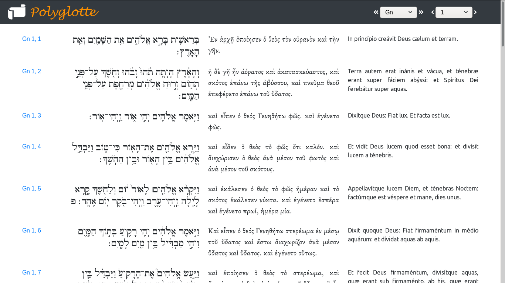

## Polyglotte

Bible in Hebrew, Greek and Latin for the Lectio divina of the monks of the Saint-Joseph Abbey.

Web app written in Django.

Hebrew and greek verses have been removed from the database polyglotte.sql, as they are not in the public domain.

The latin text is a copy (April 24th 2020) of the accented Vulgate hosted [here](https://github.com/gregorio-project/latin-ecclesiastic-accents/blob/master/corpus/vulgate/vulgate_with_accents.txt).

## Preview

